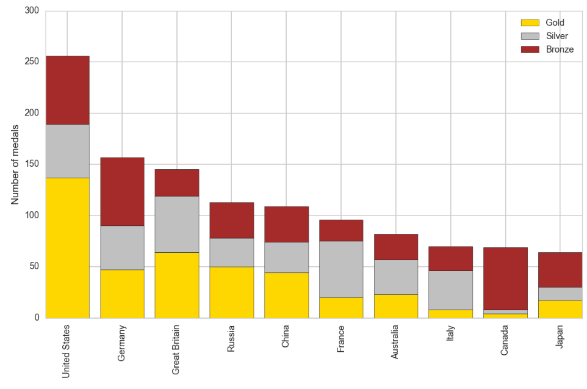
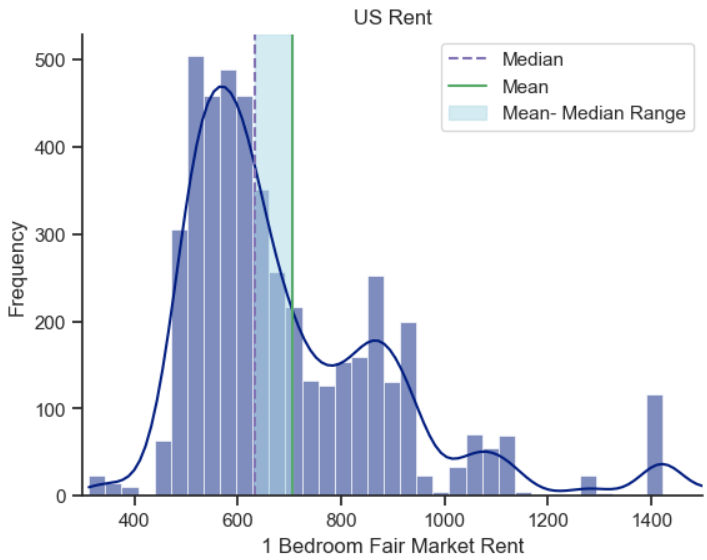
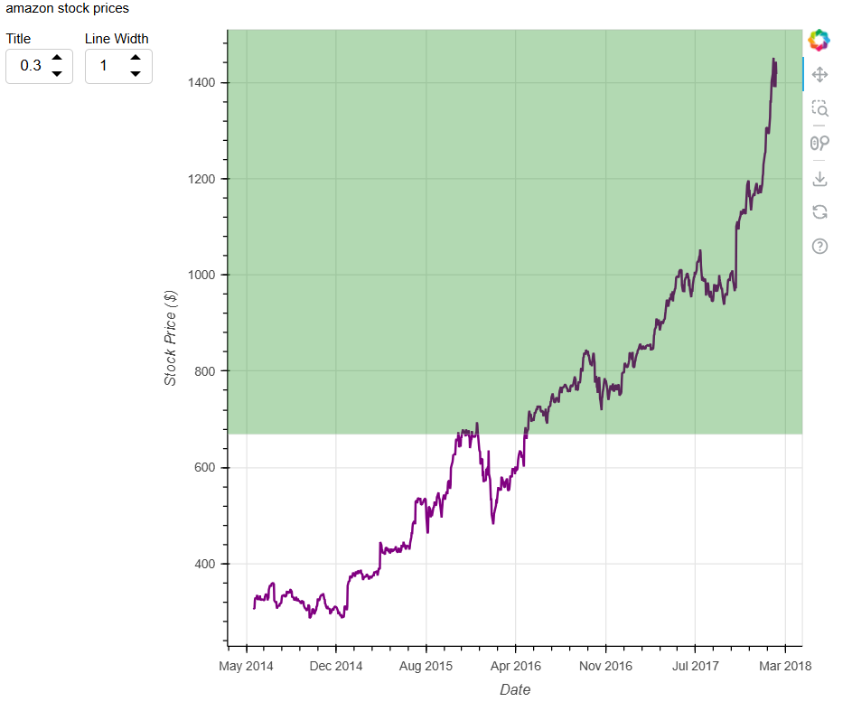

# 📊 Data Visualization with Python

Projekt prezentuje różne techniki wizualizacji danych w Pythonie z wykorzystaniem trzech popularnych bibliotek:

- **Matplotlib** – klasyczne wykresy statyczne  
- **Seaborn** – estetyczne wykresy statystyczne  
- **Bokeh** – interaktywne wizualizacje w przeglądarce  

---

## 📁 Struktura repozytorium

```
├── datasets/               # Zbiory danych używane w analizach
├── assets/                 # Pliki pomocnicze / obrazy
├── matplotlib_v1.ipynb     # Przykłady wizualizacji w Matplotlib
├── seaborn.ipynb           # Przykłady wizualizacji w Seaborn
├── bokeh_.ipynb            # Przykłady wizualizacji w Bokeh
├── bokeh_plot.html         # Wygenerowana wizualizacja interaktywna
├── amazon_stock.html       # Przykład wykresu zapisanego jako HTML
├── pyproject.toml          # Konfiguracja projektu
└── README.md               # Dokumentacja projektu
```

---

## 🧠 Wymagania

Zainstaluj wymagane biblioteki:

```bash
pip install matplotlib seaborn bokeh pandas jupyter
```

---

## 📈 Zakres projektu

### 🧾 Matplotlib

- wykresy liniowe  
- histogramy  
- wykresy słupkowe  
- wykresy rozrzutu  

### 🎨 Seaborn

- wykresy rozkładu  
- wykresy zależności między zmiennymi  
- macierze korelacji  

### 🌐 Bokeh

- interaktywne wykresy  
- możliwość przybliżania (zoom)  
- zapisywanie wykresów do plików HTML  

---

## 🚀 Jak uruchomić projekt

Sklonuj repozytorium:

```bash
git clone https://github.com/MateuszPietkiewicz/data_visualization.git
```

Przejdź do katalogu projektu:

```bash
cd data_visualization
```

Uruchom Jupyter Notebook:

```bash
jupyter notebook
```

---

## 💻 Przykład użycia

### Matplotlib

```python
import matplotlib.pyplot as plt

fig, ax = plt.subplots()

ax.bar(medals.index, medals["Gold"],color="Gold", label = "Gold")
ax.bar(medals.index, medals["Silver"],color="Silver", bottom=medals["Gold"], label = "Silver")
ax.bar(medals.index, medals["Bronze"],color="Brown", bottom=medals["Gold"] + medals["Silver"], label = "Bronze")
    
ax.set_xticks(range(len(medals.index)))
ax.set_xticklabels(medals.index, rotation = 90)
    
    
ax.set_ylabel("Number of medals")
ax.legend()

plt.tight_layout()
fig.set_size_inches([12,8])
fig.savefig("assets/medals.png")
```


### Seaborn

```python
import seaborn as sns

fig, ax = plt.subplots()

sns.set_style("ticks")

sns.histplot(df["fmr_1"], ax=ax, kde=True)
ax.set(
    title="US Rent",
    xlabel="1 Bedroom Fair Market Rent",
    ylabel="Frequency",
    xlim=(300, 1500)
    
)
ax.axvline(x=df["fmr_1"].median(), color="m", label= "Median", linestyle="--")
ax.axvline(x=df["fmr_1"].mean(), color="g", label= "Mean", linestyle="-")
plt.axvspan(df["fmr_1"].median(), df["fmr_1"].mean(), color='lightblue', alpha=0.5, label="Mean- Median Range")


ax.legend()
sns.despine()
plt.show()
```


### Bokeh

```python
import pandas as pd

from bokeh.plotting import figure
from bokeh.io import output_file, show
from bokeh.models import ColumnDataSource, Div, DatetimeTickFormatter, BoxAnnotation, Spinner
from bokeh.layouts import layout


source = ColumnDataSource(data=df_amazon)

fig = figure(
    x_axis_label="Date",
    y_axis_label="Stock Price ($)",
)

fig_r =fig.line(x="date", y="close", source =source, color= "purple", line_width=2)
fig.xaxis[0].formatter = DatetimeTickFormatter(months="%b %Y")

box= BoxAnnotation(bottom=df_amazon["close"].mean(), fill_color="green", fill_alpha=0.3)
fig.add_layout(box)

title=Div(text="amazon stock prices")

spinner = Spinner (title="Title", low=0, high= 1, step=0.1, value=0.3, width=60)
spinner.js_link("value", box, "fill_alpha")

spinner_linewidth = Spinner (title="Line Width", low=0, high= 10, step=1, value=1, width=60)
spinner_linewidth.js_link("value", fig_r.glyph, "line_width")

output_file(filename="amazon_sctock.html")
show(layout([title], [spinner, spinner_linewidth, fig]))
```


---

## 📌 Cel projektu

- praktyczne poznanie bibliotek do wizualizacji danych  
- porównanie możliwości Matplotlib, Seaborn i Bokeh  
- rozwijanie umiejętności prezentowania danych w czytelny i profesjonalny sposób  